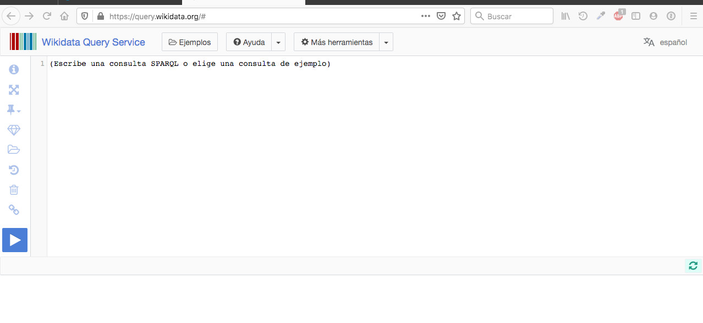

# Acceder a Wikidata Query Service

**[Wikidata Query Service](https://query.wikidata.org/)** es el servidor SPARQL de Wikidata. Se utiliza para hacer búsquedas contra Wikidata, formulando expresiones que devuelven un conjunto de elementos que responden a las condiciones formuladas.

En este breve tutorial se explica cómo usar **Wikidata Query Service** para obtener listados de monumentos. El url [https://query.wikidata.org/](https://query.wikidata.org/) lleva al usuario a la pantalla de interrogación.

Puede ser necesario, en un primer uso o si ha pasado un tiempo apreciable desde un uso anterior, que se requieran al usuario datos de identificación. El idioma puede cambiarse, si es necesario, a través del menú emergente de la esquina superior derecha de la página.

Para saber más sobre el uso de SPARQL contra Wikidata Query Service, puedes consultar el tutorial  [Wikidata:tutorial SPARQL]([Wikidata:tutorial SPARQL - Wikidata](https://www.wikidata.org/wiki/Wikidata:SPARQL_tutorial/es)).
