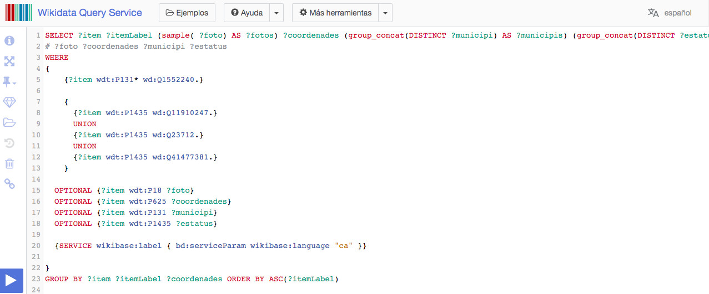

# Formular una consulta

Este tutorial no pretende que el usuario conozco en profundidad SPARQL (que es un pelín complejo), así que se ofrece una consulta de ejemplo que permite obtener como resultado un conjunto de momumentos. Los diferentes elementos de la consulta pueden modificarse según las necesidades de cada usuario.

El código de la consulta es el siguiente:

`SELECT ?item ?itemLabel (sample( ?foto) AS ?fotos) ?coordenades (group_concat(DISTINCT ?municipi) AS ?municipis) (group_concat(DISTINCT ?estatus) AS ?estatuses)
WHERE
{
    {?item wdt:P131* wd:Q1552240.}
    {
      {?item wdt:P1435 wd:Q11910247.}
      UNION
      {?item wdt:P1435 wd:Q23712.}
      UNION
      {?item wdt:P1435 wd:Q41477381.}
    }
  OPTIONAL {?item wdt:P18 ?foto}
  OPTIONAL {?item wdt:P625 ?coordenades}
  OPTIONAL {?item wdt:P131 ?municipi}
  OPTIONAL {?item wdt:P1435 ?estatus}
  {SERVICE wikibase:label { bd:serviceParam wikibase:language "ca" }}
}
GROUP BY ?item ?itemLabel ?coordenades ORDER BY ASC(?itemLabel)`

Al ejecutar la orden se obtiene un listado de todos los momentos del municipio de Sueca (Valencia, España) que tienen un elemento en Wikidata. El listado se presenta en formato de tabla, con el nombre del monumento en catalán, la identificación del elemento y algunos datos. Pero antes de verlo en detalle, vamos a explicar algunos elementos de la consulta que cualquier usuario puede modificar para su caso particular. La parte que interesa empieza en la claúsula **WHERE**.

## Por qué mola P131* más que P131

Fijaos en la línea que dice

`{?item wdt:P131* wd:Q1552240.}`

La voy a explicar, que es muy útil. **P131** es una propiedad de Wikidata: “Situado en la unidad territorial administrativa”. Como **Q1552240** es Sueca, la búsqueda se hará sobre cosas que estén en Sueca. Más correctamente, buscará entre los elementos Q que tengan una **P131** que sea igual a **Q1552240**.

Veréis que **P131** lleva un asterisco. Eso sirve para incluir las unidades que están incluidas en la unidad administrativa o en sus subdivisiones. Por eso es conveniente usar **P131***, porque así obtenemos lo que está localizado en una subdivisión administrativa.

Por ejemplo, **Q91101465** "Retablo cerámico de Santa Teresa de Jesús en el Convento del Carmen", tiene como valor para **P131** el barrio del Carmen (**Q5398029**). Pero si buscamos en la Comunidad Valenciana, provincia de Valencia, municipio de Valencia o distrito de Ciutat Vella, siempre que usemos el *, nos aparecerá en las listas.

## P1435 sirve para decir que es un monumento

**P1435** es la propiedad de Wikidata “estatus patrimonial”. Cuando decimos que el "Patio de los Silos de Burjassot" (**Q5789714**) es Bien de Interés Cultural, lo que decimos en Wikidata es que su **P1435** es **Q23712**.

Veréis que para **P1435** hemos tenido que hacer una virguería con varias líneas:

  `  {
      {?item wdt:P1435 wd:Q11910247.}
      UNION
      {?item wdt:P1435 wd:Q23712.}
      UNION
      {?item wdt:P1435 wd:Q41477381.}
    }`

Eso es porque hay monumentos con diferentes estatus patrimoniales. Para la Comunidad Valenciana uso tres: **Q23712** (Bien de Interés Cultural), **Q11910247** (Bien de Relevancia Local) y **Q41477381** (Bien Inmueble de Etnología). Los últimos dos grupos son propios de la Comunidad Valenciana. **Q23712** es el identificador de Bien de Interés Cultural (BIC) en España. De la misma forma podéis añadir los estatus que creáis convenientes para la comunidad o ámbito que os interese. Simplemente añadid, eliminad o modificad líneas.

Algunos valores que no se han usado en el ejemplo pero que os pueden interesar son:

- Q9259: Patrimonio de la Humanidad
- Q1019352: Bien Cultural de Interés Nacional (Cataluña)
- Q27680146: Bien en el Catálogo General del Patrimonio Histórico Andaluz
- Q43113623: Parte de un sitio Patrimonio de la Humanidad
- Q66087628: Bien cultural protegido grado 1 (Navarra)
- Q66087636: Bien cultural protegido grado 2 (Navarra)
- Q66087645: Bien cultural protegido grado 3 (Navarra)
- Debe haber más...

## ¿Y si lo quiero en otra lengua o idioma?

Para elegir la lengua en la que salen los nombres de los monumentos, hay que modificar la línea

`{SERVICE wikibase:label { bd:serviceParam wikibase:language "ca" }}`

Donde dice “ca”, probad con “es”, “gl”, “en”, “zh”… A elección del usuario.
