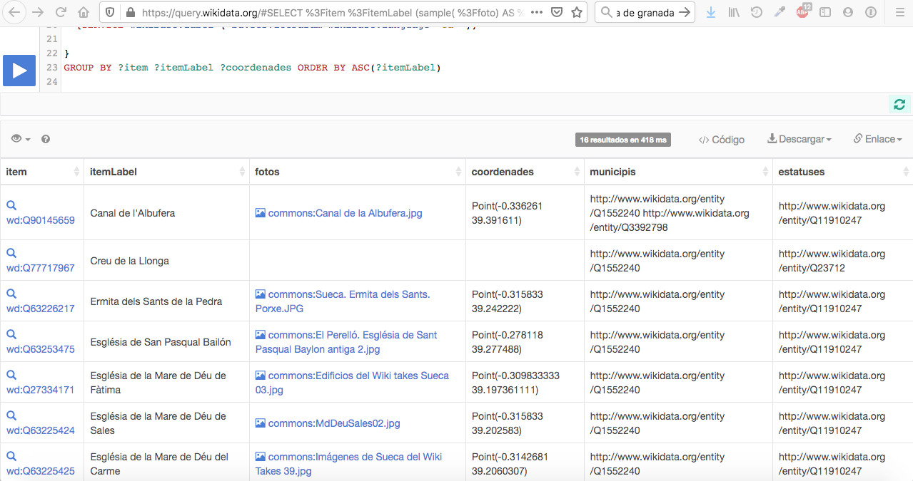
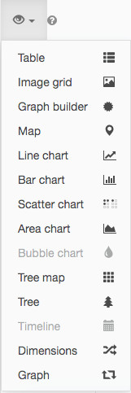
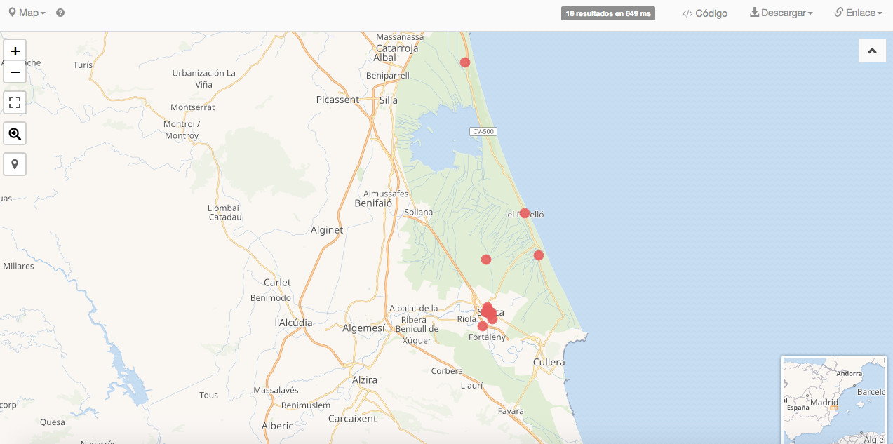

# Usar los resultados

Volviendo el ejemplo de Sueca, la respuesta se presenta en formato de tabla

Encima de la columna **ítem**, hay un icono de un ojo. Sirve para hacer que se despliegue un menú:

Son las formas en que se puede presentar la información. Por defecto sale en tabla. Otra opción que es muy útil en este caso es en forma de mapa. Luego volveremos a ello.

## Columnas

Las columnas contienen los diferentes datos extraídos de cada Q. No voy a entrar en qué poner o cómo, porque eso es difícil, por lo menos para mí (me llevó varios días y dos asesores llegar hasta aquí).
Esta tabla está personalizada para que devuelva resultados incluso para el caso de casillas vacías (en este caso, Qs que por la razón que sea no tienen foto o coordenadas, ya que tanto municipio como estatus son condiciones necesarias para salir en la lista). Atención a ello, porque no es muy evidente (por lo menos para mí al principio) cómo se consigue que esto salga así.

1. **Columnas Item e ItemLabel**: Veréis que en una pone el número Q y en la otra el nombre del monumento. Si en ItemLabel os sale también el número Q, eso quiere decir que el monumento no tiene nombre en la lengua que habéis elegido: ya estáis tardando en arreglar eso.
2. **Columna de coordenadas**: No tener coordenadas supone que los monumentos no salgan en los mapas. Las coordenadas pueden ser difíciles. No siempre, pero pueden ser realmente muy difíciles de obtener. Si faltan, se supone que hay que conseguirlas, pero no siempre se puede. Pero si puedes y las pones, ir al monumento está chupado.
3. **Columna Fotos**: Está hecha para que salgan las direcciones de Commons de las fotos y no las propias imágenes. Es por un tema técnico que no recuerdo, pero a efectos prácticos no es muy grave. Los buscadores de fotos buscamos qué no tiene foto para ir y fotografiarlo. Por tanto, la casilla en blanco está pidiendo un viaje. Nota: mirad primero en Commons, todo sea que ya haya foto y no la hayan enchufado a Data. Infrecuente, pero posible.
4. Finalmente, ¿habéis visto que el primer ítem sale en dos municipios? Es posible, al igual que es posible que tenga más de un estatus como monumento. Conviene mirarlo por si es un error, pero puede ser lo correcto.

## Mapa

La información también puede presentarse sobre un mapa (siempre y cuando los Q tengan las correspondientes coordenadas, claro está).

Estos mapas, además de mejorar la autoestima del que los hace, son prácticos. Por ejemplo, en la primera batida de monumentos de la Comunidad Valenciana el mapa sacaba bienes en Madrid, en la provincia de Cuenca y en medio del Mediterráneo. Teniéndolos localizados, los rectificamos con bastante facilidad.
Por cierto, el punto que sale más al norte, de hecho en término de Valencia, corresponde al bien que Sueca y Valencia tienen “a medias”. Es una acequia y debería representarse como un recorrido y no como un punto. Pero ya he dicho que “is difficult”.

Y a partir de aquí, toca probar y ver que bueno y práctico es Wikidata Query Service...
